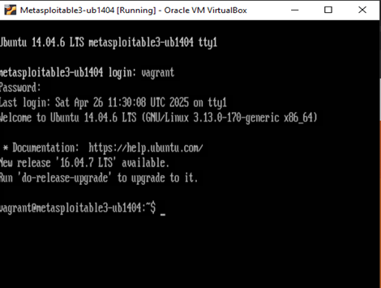
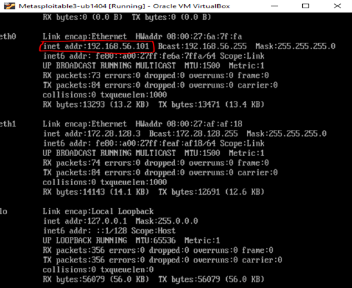
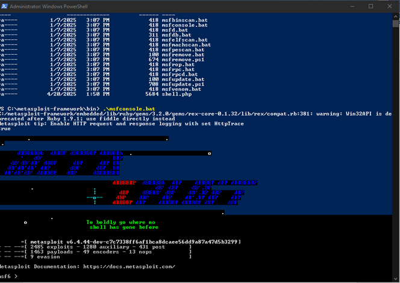
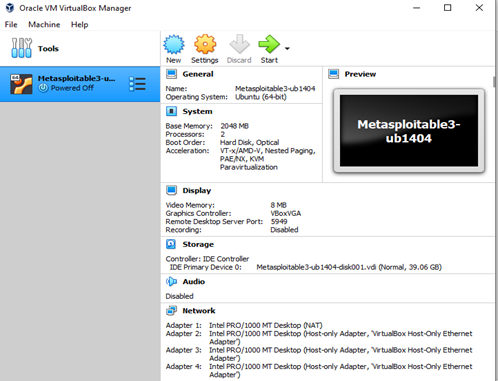
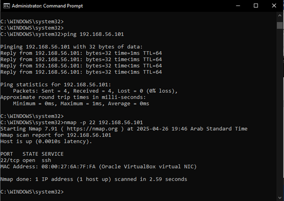
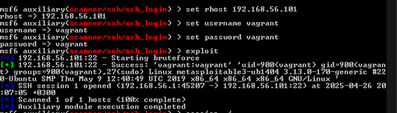
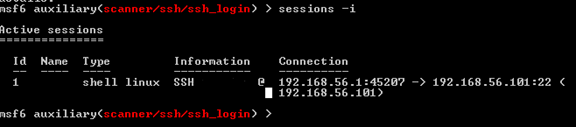
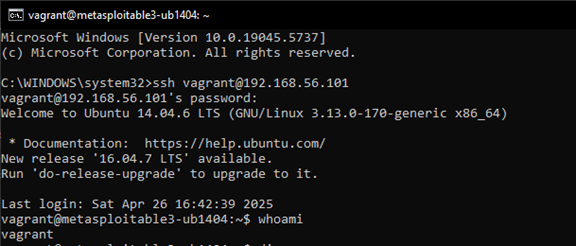
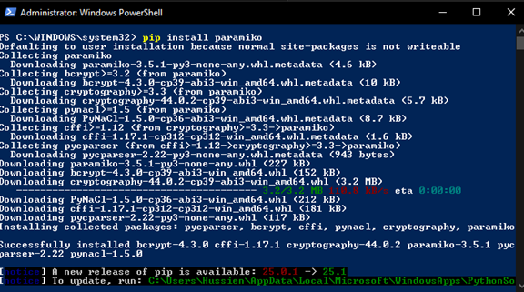
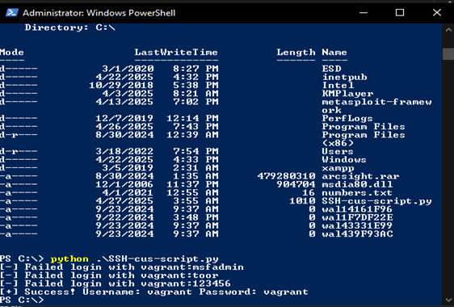

# ICS344 Course Project

## Phase 1: Setup and Compromise the Service

In Phase 1, we set up the attacker and victim machines by following the steps from the official repository for the ICS 344 Course. We compromised the SSH service on the Metasploitable VM, which is already vulnerable, by connecting from the attacker machine to the victim. Then, we created a Python script to brute force SSH authentication on the Metasploitable server.

---

## Victim Environment

After downloading and installing Metasploitable on VirtualBox:

### 🖼️ Image 1: Login using username and password `vagrant`


### 🖼️ Image 2: Check the IP address using `ifconfig`


### 🖼️ Image 3: Verify connection using `ping`


---

## Attacker Environment

After downloading and installing Kali tools and launching Metasploit using:
```
.\msfconsole.bat
```

---

## Task 1.1: Use Kali Linux tool Metasploit to compromise the service

After verifying the connection, we used the `nmap` tool to scan for the SSH port:

### 🖼️ Image 4: Result of `nmap -p 22 192.168.56.101`


We used the Metasploit module: `auxiliary/scanner/ssh/ssh_login` and set the following options:

```
set rhost 192.168.56.101
set username vagrant
set password vagrant
exploit
```

### 🖼️ Image 5: Executing the exploit and opening SSH session



After opening the session, we used the `whoami` command:

### 🖼️ Image 6: Output of `whoami` inside the session


---

## Task 1.2: Compromise the service using a custom script

We installed the Python library `paramiko` for SSH:

### 🖼️ Image 7: Installing paramiko library


Then we ran the custom script `SSH-cus-script.py`, which tries multiple passwords until it finds the correct one:

### 🖼️ Image 8: Script success with correct password



