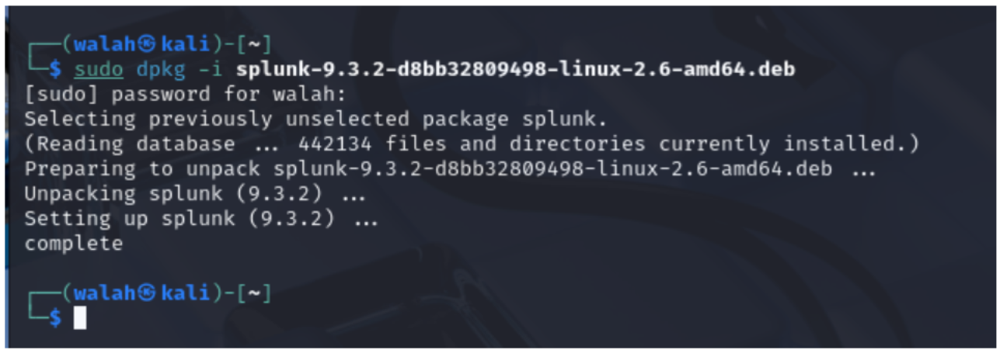
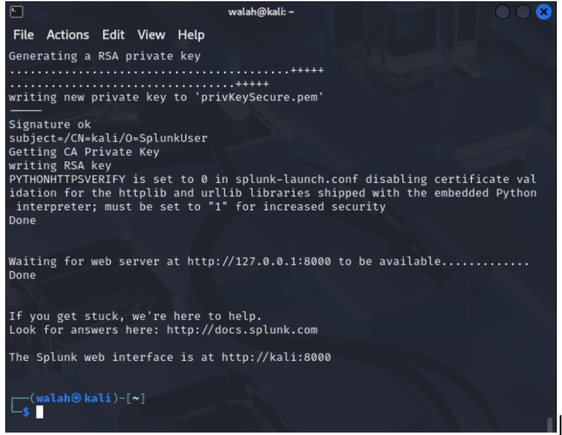
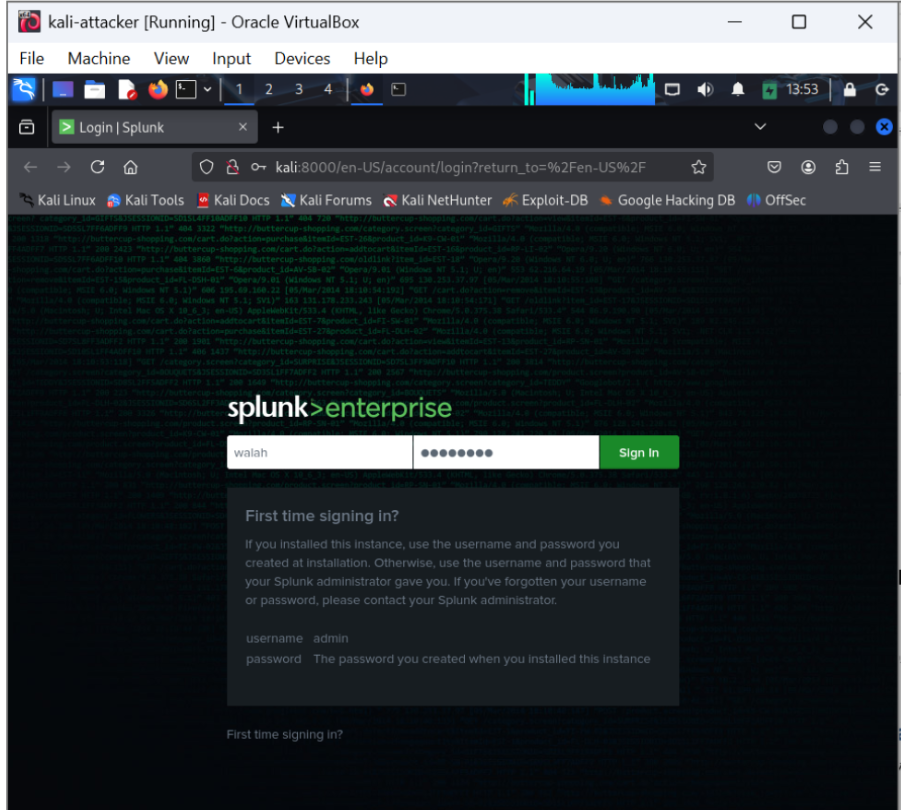
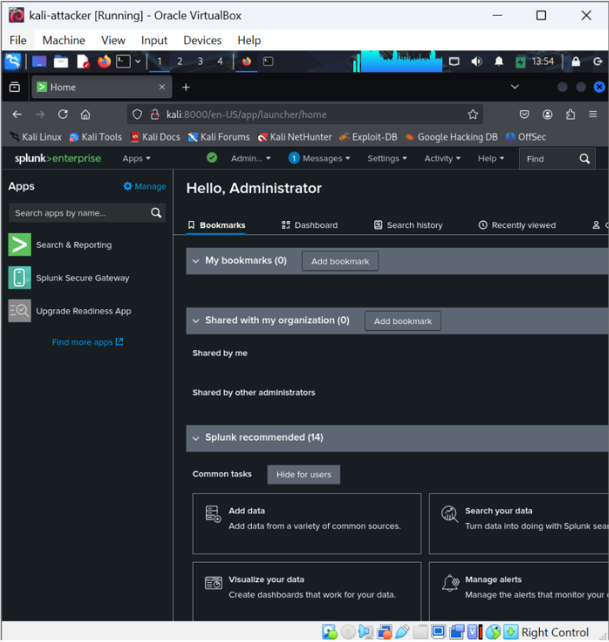
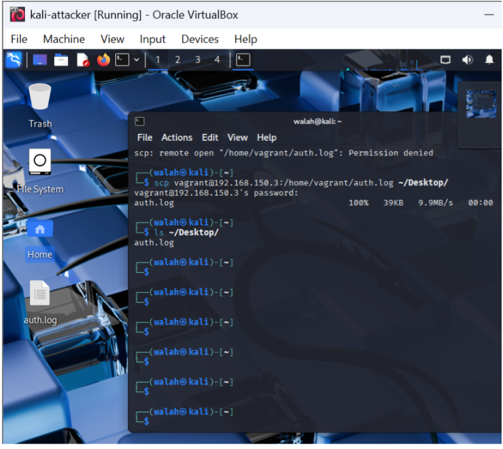
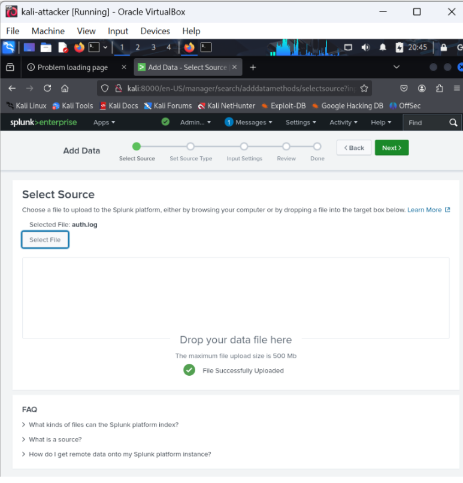

---
# Phase 2 - SIEM Dashboard Analysis using Splunk on Kali
In this phase, we used **Splunk on Kali Linux** to analyze logs collected from the victim machine (**Metasploitable3**).
...
After multiple attempts to install and configure the **Splunk Universal Forwarder** on the victim, we encountered persistent compatibility errors due to the outdated operating system and unsupported architecture.
As a result, we decided to adopt a **manual approach**:

* Log files were securely transferred using `scp` from the victim to the attacker machine (Kali),
* Then uploaded to Splunk for visualization and analysis.
---
## Step 1: Install Splunk on Kali Linux

We downloaded and installed **Splunk Enterprise** on Kali Linux using the `.deb` package.
After accepting the license and starting the service, we accessed the Splunk Web Interface at:
[http://localhost:8000/](http://localhost:8000/)

### 1. Installing Splunk using dpkg

---
### 2. Initial Splunk Configuration



---

## Step 2: Access Splunk Web Interface

We logged into Splunk Web Interface using the **admin credentials** set during the initial setup.

### 3. Login Screen on Kali Linux


---

### 4. Administrator Dashboard View


---

## Step 3: Manually Upload Log Files to Splunk

We used the `scp` command on Kali to copy the file from the victim (Metasploitable3):

```bash
scp vagrant@<victim-ip>:/home/vagrant/auth.log ~/Desktop/
```

Then, we used **Splunk Web**:

> `Add Data` → `Upload File`
> to ingest the log file into the system.

✅ The log file was uploaded successfully to Splunk and is ready for searching and analysis.

### 5. SCP Log Transfer Process

---
### 6. Splunk Web File Upload Confirmation

---
### 7. SCP Log Transfer Process


---

## Step 4: Search and Analyze Logs

We used the **Splunk Search & Reporting App** to:

* Analyze login attempts
* Track failed authentications
* Investigate SSH behavior

This helped us identify successful and failed SSH login attempts initiated during the attack.


---

## Step 5: Dashboard Visualization

📈 This spike in the graph indicates a **significant increase in events** related to unauthorized access attempts.
The rise reflects the attacker's **repeated SSH login attempts**, which were captured by the system and visualized through Splunk dashboards.


---


