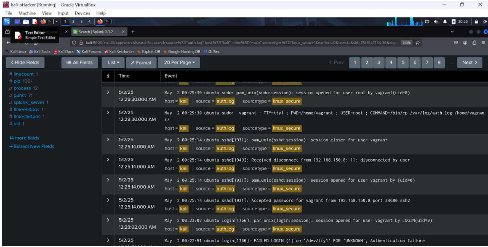

# Phase 3 – Defensive Strategy Proposal

In this phase, we implemented a **defensive strategy** on the victim machine (**Metasploitable3**) to mitigate the previous attacks observed in Phase 2.  
The goal was to enhance system security and verify the effectiveness of the defense using **testing and log analysis through Splunk**.

---

## Step 1: Identify the Attack

We used **Splunk** to analyze the uploaded `auth.log` file.  
From the log entries, we identified multiple **SSH login activities**, including both accepted and failed attempts.

### 1. Timeline of Authentication Logs

---
## Step 2: Apply Defense Mechanism

To mitigate **SSH brute-force attempts**, we implemented the **Fail2Ban** tool on the victim machine.  
Fail2Ban monitors log files and **automatically bans IPs** that show malicious behavior.

##Photo 13

---

## Step 3: Rerun the Attack

Before applying the defense mechanism:
- The attacker was able to perform multiple SSH login attempts.
- Splunk logs showed repeated `"Failed password"` events.

After configuring Fail2Ban:
- Repeated failed login attempts led to the **automatic banning** of the attacker's IP.
- The jail status confirmed that **IP `192.168.150.8` was successfully banned** after reaching 50 failed attempts.

##Photo 14&15
---

## Step 4: Analyze Logs in Splunk

We retrieved the updated `fail2ban.log` file from the victim machine and uploaded it to Splunk.

By searching for events containing the keyword `"Ban"`:
- We confirmed that **IP 192.168.150.8** was successfully banned.

📉 The line chart below shows the number of SSH-related events over time.  
There was a **noticeable drop** in activity after the defense was enabled, indicating that **Fail2Ban blocked the brute-force attempts**.

##Photo 16&17
---

## Step 5: Compare Before and After

To evaluate the effectiveness of **Fail2Ban**, we compared the logs **before and after** applying the defense:

### 🔴 Before Defense (Screenshot 1):

- Screenshot from `auth.log` in Splunk.
- Shows multiple SSH login events (both successful and failed).
- Indicates the system was exposed to **brute-force attempts** with no protection.

### ✅ After Defense (Screenshot 2):

- Screenshot from `fail2ban.log` in Splunk.
- Shows that Fail2Ban detected repeated failed attempts and **banned IP `192.168.150.8`**.
- Confirms that the **defense mechanism was effective** in stopping further login attempts.

##Photo 18&19
---

